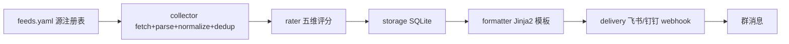

# InfoDigest

> 轻量、零运维、可自托管的开源信息聚合器。基于 RSS 的信息收集系统：采集 → 去重 → 规则评级 → 模板排版 → 定时推送到飞书/钉钉，通过 GitHub Actions 部署与调度。**全链路确定性代码，不依赖任何大模型。**


## 特性

- 📡 **RSS 采集**：httpx 增量抓取（ETag/Last-Modified），feedparser 解析 RSS2/Atom/RDF
- 🔄 **去重**：sha1 主键 + SequenceMatcher/Jaccard 标题相似度 + 48h 时序去重
- 📊 **规则评级**：五维评分 × 兴趣权重 + 事件档加成 + 衰减/新颖度，S/A/B/C 分级
- ✂️ **策展裁剪**：日配额、噪声过滤、无高价值静默（宁可少说）
- 📝 **模板排版**：Jinja2 渲染飞书 interactive card / 钉钉 markdown，分段限流
- 🚀 **双通道推送**：飞书 + 钉钉 webhook（含 HMAC 签名），令牌桶限流
- 💾 **SQLite 持久化**：条目/运行记录/源缓存/事件历史，增量入库
- ⏰ **GitHub Actions 调度**：cron 每日 09:00/17:00（北京时间）自动运行
- 🔒 **安全**：密钥走 Secrets，永不入仓
- 🚫 **无 LLM**：全链路确定性，零 API 成本

## 架构



```
config ──▶ collector ──▶ rater ──▶ storage ◀── formatter ◀── delivery
   ▲___________________________________________________│
                      scheduler.runner 编排以上
```

## 快速开始

### 1. 克隆 & 安装

```bash
git clone https://github.com/xuess/info-radar.git
cd info-radar
python3 -m venv .venv && source .venv/bin/activate
pip install -r requirements.txt
```

### 2. 配置源（可选，默认 8 源）

编辑 `config/feeds.yaml` 添加/修改 RSS 源。

### 3. 配置推送（webhook）

```bash
export FEISHU_WEBHOOK="https://open.feishu.cn/open-apis/bot/v2/hook/xxx"
export FEISHU_SECRET="your-feishu-secret"
export DINGTALK_WEBHOOK="https://oapi.dingtalk.com/robot/send?access_token=xxx"
export DINGTALK_SECRET="your-dingtalk-secret"
```

### 4. 运行

```bash
python -m infodigest.cli run          # 全链路：采集→评级→推送
python -m infodigest.cli collect      # 仅采集
python -m infodigest.cli report       # 查看运行统计
python -m infodigest.cli sources      # 列出源
```

## GitHub Actions 部署

1. Fork 仓库。
2. Settings → Secrets → 添加 `FEISHU_WEBHOOK` / `FEISHU_SECRET` / `DINGTALK_WEBHOOK` / `DINGTALK_SECRET`。
3. `.github/workflows/digest.yml` cron `0 1,9 * * *` 自动每日 09:00/17:00（北京时间）运行。
4. 也可在 Actions 页面手动 `workflow_dispatch` 触发。

## 配置说明

| 文件 | 用途 |
|---|---|
| `config/feeds.yaml` | RSS 源注册表（id/url/category/authority/tags/enabled） |
| `config/rater.yaml` | 评分权重/关键词/事件档/配额/时序去重 |
| `config/user_interests.yaml` | 兴趣权重（category/tag → 乘数） |
| `config/settings.yaml` | 全局：存储路径/调度/推送通道开关/限流 |
| `config/templates/*.j2` | 飞书 card / 钉钉 markdown / 通用段落模板 |

### 评分公式

```
final = clamp(base * interest + event_boost - decay + novelty, 0, 100)
base  = 30*authority + 25*freshness + 25*relevance + 10*uniqueness + 10*engagement
```
- 分级：≥90 S · ≥75 A · ≥50 B · <50 C（默认不推）
- 策展：48h 去重、日配额、无高价值则静默不推

详见 `RATING_SPEC.md`。

## OPML 导入

```bash
python scripts/opml_import.py path/to/feeds.opml
```

## 测试

```bash
pytest --cov=infodigest --cov-report=term-missing   # 179 tests, 88% coverage
ruff check infodigest tests scripts                  # lint clean
```

## 项目结构

```
infodigest/
├── config.py           # dataclass + yaml 加载
├── cli.py              # run/collect/report/sources
├── collector/          # fetcher/parser/normalizer/dedup
├── rater/              # scorer 五维评分
├── storage/            # models/repo SQLite
├── formatter/          # builder Jinja2 + 分段
├── delivery/           # feishu/dingtalk/limiter/failed_digests
└── scheduler/          # runner 编排
config/                 # feeds/rater/settings + templates
tests/                  # 单元+集成+回归, 88% 覆盖
.github/workflows/      # ci + digest cron + release
```

## 贡献

见 `docs/CONTRIBUTING.md`。欢迎通过 PR 添加 RSS 源或改进。

## License

MIT
